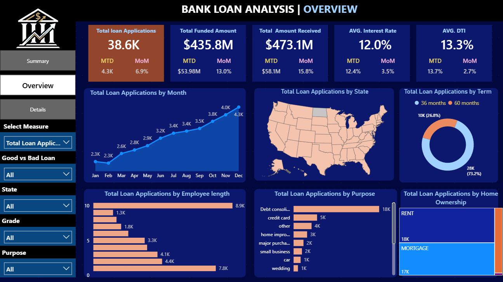
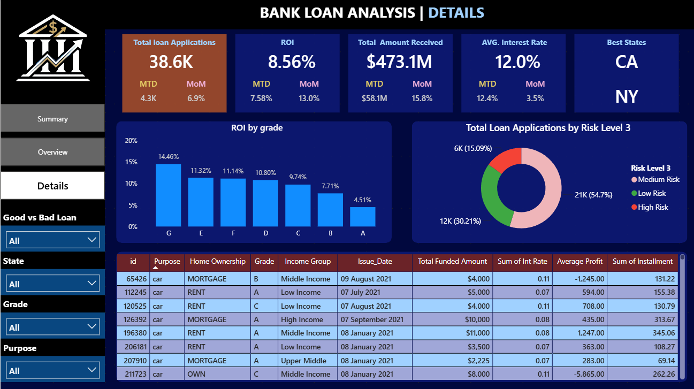

<div align="center">


# 🏦 Bank Loan Portfolio Analysis

# YT Link :- https://youtu.be/R9Vc-L-WIes

### End-to-End Data Analytics Project using Python, PostgreSQL, SQL & Power BI

[](https://www.python.org/)
[](https://www.postgresql.org/)
[](https://powerbi.microsoft.com/)
[](#-sql-business-analysis)
[](https://jupyter.org/)


</div>

---

## 📌 Project Overview

The **Bank Loan Portfolio Analysis** project evaluates the overall health and performance of a financial institution's loan portfolio. It transforms raw loan data into meaningful business insights related to loan applications, funding, repayments, borrower risk, portfolio quality, customer segments, and profitability.

The project follows a complete analytics workflow:

> **Raw Data → Python Cleaning & EDA → PostgreSQL → SQL Analysis → Power BI Dashboard → Business Insights**

This project is designed as a professional Data Analyst portfolio project and demonstrates practical skills in data cleaning, database management, SQL querying, DAX calculations, dashboard development, and business storytelling.

---

## ❓ Problem Statement

Banks issue thousands of loans, but funding a loan is only the beginning of the lending process. To make responsible and profitable credit decisions, a bank must continuously answer questions such as:

- Which loans are performing well?
- Which borrowers are more likely to default?
- How much money has been funded and recovered?
- Which loan purposes, grades, states, and customer groups are most valuable?
- How is the portfolio changing month over month?
- Which segments require stricter monitoring?

Without structured portfolio analysis, a bank may face rising defaults, weak recovery performance, poor lending decisions, and reduced profitability.

---

## 🎯 Business Objectives

- Monitor total loan applications, funded amount, and repayments
- Analyze good loans versus bad or charged-off loans
- Measure monthly, MTD, PMTD, and MoM performance
- Identify low-risk, medium-risk, and high-risk loan segments
- Evaluate borrower affordability using DTI and annual income
- Compare performance by loan grade, purpose, state, and customer segment
- Identify profitable and underperforming portfolio areas
- Provide clear recommendations for risk-adjusted lending decisions

---

## 🛠️ Tools & Technologies

| Tool | Purpose |
|---|---|
| 🐍 **Python** | Data cleaning, preprocessing, feature engineering, and EDA |
| 📒 **Jupyter Notebook** | Interactive analysis and documentation |
| 🐘 **PostgreSQL** | Structured storage of the cleaned dataset |
| 🧮 **SQL** | KPI calculation and business analysis |
| 📊 **Power BI** | Interactive dashboards, DAX measures, and reporting |
| 🌐 **GitHub** | Version control, documentation, and project portfolio |

---

## 🔄 Project Workflow

<div align="center">


</div>

### Workflow Stages

1. **Business Understanding**  
   Defined portfolio monitoring, repayment, risk, and profitability objectives.

2. **Data Collection**  
   Used raw financial loan data along with banking domain knowledge.

3. **Data Cleaning in Python**  
   Handled missing values, duplicates, data types, and date columns.

4. **Feature Engineering**  
   Created analytical fields such as risk level, loan term, DTI category, income category, and loan-status classification.

5. **Exploratory Data Analysis**  
   Studied distributions, trends, borrower behavior, and portfolio relationships.

6. **PostgreSQL Integration**  
   Uploaded the cleaned dataset into PostgreSQL for structured querying.

7. **SQL Business Analysis**  
   Calculated KPIs and answered portfolio, repayment, customer, geographic, and risk-related business questions.

8. **Power BI Dashboard Development**  
   Built DAX measures, KPI cards, slicers, charts, and interactive report pages.

9. **Business Insights & Recommendations**  
   Converted analytical findings into decision-ready recommendations.

---

## 📂 Dataset Overview

| Attribute | Value |
|---|---:|
| Total Records | **38,576** |
| Total Columns | **33** |
| Missing Values After Cleaning | **0** |
| Data Format | CSV |
| Primary Analysis Table | `cleaned_financial_loan` |

### Important Fields

- `loan_amount`
- `total_payment`
- `loan_status`
- `int_rate`
- `dti`
- `annual_income`
- `grade`
- `sub_grade`
- `purpose`
- `address_state`
- `issue_date`
- `home_ownership`
- `verification_status`
- `risk_level`

### Engineered Features

- Loan status binary
- Loan term
- Risk level
- Income category
- Income group
- Interest category
- Loan amount category
- DTI category

---

## 🧹 Data Cleaning & Preparation

The Python notebook includes the following steps:

- Imported and inspected the raw dataset
- Checked data types, null values, and duplicate records
- Standardized column names
- Converted date columns to proper datetime format
- Cleaned employment length and numeric fields
- Validated categorical values
- Created reusable analytical features
- Exported the final cleaned dataset
- Uploaded the cleaned data into PostgreSQL

---

## 📊 Executive KPI Summary

| KPI | Result |
|---|---:|
| Total Loan Applications | **38.6K** |
| Total Funded Amount | **$435.8M** |
| Total Amount Received | **$473.1M** |
| Average Interest Rate | **12.0%** |
| Average DTI | **13.3%** |
| Good Loan Percentage | **86.2%** |
| Bad Loan Percentage | **13.8%** |
| Good Loan Applications | **33.2K** |
| Bad Loan Applications | **5.3K** |
| Good Loan Funded Amount | **$370.2M** |
| Bad Loan Funded Amount | **$65.5M** |

---

## 📈 Power BI Dashboard

The Power BI report contains multiple pages covering executive KPIs, portfolio trends, loan details, risk analysis, and business insights.

### 1️⃣ Executive Summary

<div align="center">


</div>

**Highlights**

- Portfolio-level KPI cards
- MTD and MoM performance
- Good loan versus bad loan analysis
- Funded and received amount comparison
- Average interest rate and DTI monitoring

---

### 2️⃣ Portfolio Overview

<div align="center">



</div>

**Highlights**

- Monthly loan application trends
- Loan-purpose analysis
- Grade and term distribution
- Geographic performance
- Customer segmentation

---

### 3️⃣ Loan Details

<div align="center">



</div>

**Highlights**

- Record-level loan information
- Borrower and loan attributes
- Dynamic slicers and filters
- Detailed portfolio investigation

---

## 🧮 SQL Business Analysis

The SQL analysis covers:

- Total and monthly loan applications
- Funded and received amount analysis
- Average interest rate and DTI
- MTD, PMTD, and MoM calculations
- Good loan and bad loan KPIs
- Loan status performance
- Loan-purpose analysis
- Grade and sub-grade analysis
- State-wise portfolio analysis
- Term and home-ownership analysis
- Customer income segmentation
- Risk-level analysis
- Profitability and repayment analysis

The complete SQL file is available in the `SQL` folder.

---

## 🔍 Key Business Insights

### ✅ Strong overall portfolio quality

Approximately **86.2%** of applications are classified as good loans, indicating that most borrowers are either fully repaying their loans or are currently meeting repayment obligations.

### ⚠️ Bad loans remain financially significant

Bad loans account for approximately **13.8%** of all applications. Although this is a minority of the portfolio, these loans represent a meaningful difference between funded and recovered amounts.

### 💰 Total recovery exceeds total funding

The portfolio funded approximately **$435.8M** and received around **$473.1M**, showing positive aggregate repayment performance.

### 📉 Risk requires multi-factor evaluation

Risk should not be measured through a single variable. Interest rate, DTI, grade, income, employment length, verification status, and loan purpose should be evaluated together.

### 🌍 Geographic performance supports targeted strategy

State-level analysis can identify high-performing markets for expansion and weaker markets that may require stricter lending or verification rules.

### 👥 Customer segmentation improves decision-making

Income, DTI, loan amount, and verification status help distinguish customers with stronger affordability from those requiring closer monitoring.

### 📅 Monthly analysis provides early warning signals

MTD, PMTD, and MoM measures help identify sudden changes in application volume, funding, repayment, interest rate, and portfolio risk.

---

## 💡 Business Recommendations

1. **Strengthen risk-based approval rules**  
   Use grade, DTI, income, interest rate, employment length, and verification status together.

2. **Monitor high-risk segments monthly**  
   Track rising defaults, weakening repayments, and rapid high-risk portfolio growth.

3. **Prioritize profitable good-loan segments**  
   Focus acquisition and retention efforts on customer groups with strong repayment performance.

4. **Improve charged-off loan recovery**  
   Prioritize collection efforts based on expected recovery value, loan amount, purpose, and borrower profile.

5. **Control portfolio concentration**  
   Avoid excessive exposure to a single state, loan purpose, grade, or borrower segment.

6. **Refresh the dashboard regularly**  
   Use the report as an ongoing portfolio monitoring and decision-support tool.

---

## 📁 Repository Structure

```text
Bank-Loan-Portfolio-Analysis/
│
├── Data/
│   ├── financial_loan.csv
│   └── cleaned_financial_loan.csv
│
├── Images/
│   ├── Bank Logo.png
│   ├── Details.png
│   ├── Executive Summary.png
│   ├── Overview.png
│   └── WorkFlow.png
│
├── Notebook/
│   └── Bank_Loan_Analysis.ipynb
│
├── PowerBI/
│   └── bank loan.pbix
│
├── Report/
│   ├── Bank Loan Portfolio Analysis PPT.pdf
│   ├── Insights.md
│   └── Report.pdf
│
├── SQL/
│   └── Bank Loan Analysis quires.sql
│
└── README.md
```

---

## 🚀 How to Explore the Project

### 1. Clone the repository

```bash
git clone https://github.com/DivyanshuGautam91/Bank-Loan-Portfolio-Analysis.git
```

### 2. Open the Python analysis

Open:

```text
Notebook/Bank_Loan_Analysis.ipynb
```

in Jupyter Notebook or JupyterLab.

### 3. Review the SQL analysis

Open the SQL script from the `SQL` folder and execute the queries in PostgreSQL or pgAdmin.

### 4. Open the Power BI dashboard

Open:

```text
PowerBI/bank loan.pbix
```

using Power BI Desktop.

### 5. Read the final findings

The `Report` folder contains the project report, presentation, and detailed business insights.

---

## 🔐 Security Note

Database passwords, private connection strings, API keys, and personal credentials should never be committed to GitHub. Replace any local database password in the notebook with a placeholder such as:

```python
password = "YOUR_PASSWORD"
```

---

## 📌 Project Highlights

- ✅ End-to-end analytics workflow
- ✅ 38,576 cleaned loan records
- ✅ Python data cleaning and feature engineering
- ✅ PostgreSQL database integration
- ✅ Business-focused SQL analysis
- ✅ Advanced DAX measures
- ✅ Interactive multi-page Power BI dashboard
- ✅ MTD, PMTD, and MoM performance tracking
- ✅ Risk, customer, geographic, and profitability insights
- ✅ Professional documentation and presentation

---

## 👨‍💻 Author

### Divyanshu Gautam

[](https://github.com/DivyanshuGautam91)

> Data Analytics | Python | SQL | PostgreSQL | Power BI

---

## ⭐ Support

If you found this project useful, consider giving the repository a **star ⭐**.

<div align="center">

### Thank you for visiting this project! 🚀

</div>
